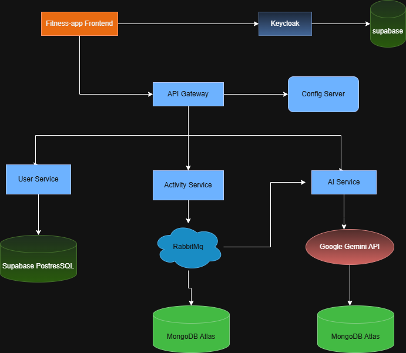

 # 🏋️ Fitness Microservices Platform (Cloud-Native)

## 🚀 Live Application

🌐 Frontend: [https://fitness-app-2dc80.web.app](https://fitness-app-2dc80.web.app)

Google Cloud was used for deploying backend services and infrastructure components.

Deployment steps and commands are documented here:

docs/deployment-guide.md

---
## 🎬 Application Demo

## 🎥 Deployment Demo

Watch full deployment demo here:
[Full Video Link](https://youtu.be/mjVjbt7Dz1A)

---
## 📌 Overview

This project is a fully cloud-deployed **Fitness Tracking & AI Recommendation Platform** built using a distributed microservices architecture.

It consists of:

* React + Vite frontend
* Spring Boot microservices
* Centralized configuration management
* Secure OAuth2 authentication
* Event-driven architecture
* AI-powered fitness recommendations

The system is deployed on:

* Google Cloud Platform
* Firebase
* MongoDB Atlas
* Supabase

---

# 🏗 High-Level Architecture

The platform follows a microservices + event-driven architecture:

---

# 🧩 Core Components

## 🎨 1️⃣ Frontend

* Built using React + Vite
* Hosted on Firebase
* Integrates with Keycloak for login
* Communicates with API Gateway

---

## 🔐 2️⃣ Authentication Service

Authentication is handled by:

* Keycloak
* Deployed on Google Cloud Run
* Uses Supabase PostgreSQL as database
* Issues JWT tokens

Flow:

1. User logs in via Keycloak
2. JWT token is generated
3. Token is passed to frontend
4. API Gateway validates JWT for each request

---

## 🌐 3️⃣ API Gateway

* Central entry point
* Fetches dynamic configs from Config Server
* JWT validation
* Routes traffic to:

    * User Service
    * Activity Service
    * AI Service

---

## ⚙️ 4️⃣ Config Server

* Centralized configuration management
* Environment-based configuration (local vs cloud)
* Used by API Gateway and other services

---

## 👤 5️⃣ User Service

* Stores user profile data
* Uses Supabase PostgreSQL
* Maintains mapping with Keycloak user ID

---

## 🏃 6️⃣ Activity Service

* Stores fitness activities
* Uses MongoDB Atlas
* Publishes activity events to RabbitMQ
* Acts as RabbitMQ Producer

RabbitMQ is deployed on a GCP VM instance.

---

## 🤖 7️⃣ AI Service

* Consumes messages from RabbitMQ
* Fetches user activity data
* Generates personalized fitness recommendations
* Uses Google Gemini API for AI response generation

Integrated with:

* Google Gemini

---

# 🔄 Event-Driven Flow

1. User logs activity
2. Activity Service stores in MongoDB
3. Activity Service publishes event to RabbitMQ
4. AI Service consumes event
5. AI Service calls Gemini API
6. Recommendation stored in MongoDB
7. Frontend fetches recommendation via API Gateway

---

# 🛠 Tech Stack

### Frontend

* React
* Vite
* Firebase Hosting

### Backend

* Spring Boot
* Spring Cloud Gateway
* Spring Security (OAuth2)
* Spring Data JPA
* Spring Data MongoDB
* WebClient

### Databases

* Supabase PostgreSQL (User & Auth data)
* MongoDB Atlas (Activity & AI data)

### Messaging

* RabbitMQ (GCP VM)

### AI

* Google Gemini API

### Cloud

* Google Cloud Run
* GCP VM
* Firebase Hosting

---

# 🌍 Deployment Model

| Component        | Deployment    |
| ---------------- | ------------- |
| Frontend         | Firebase      |
| Keycloak         | Cloud Run     |
| API Gateway      | Cloud Run     |
| User Service     | Cloud Run     |
| Activity Service | Cloud Run     |
| AI Service       | Cloud Run     |
| RabbitMQ         | GCP VM        |
| PostgreSQL       | Supabase      |
| MongoDB          | MongoDB Atlas |

---

# 💡 Key Engineering Highlights

* Secure OAuth2-based authentication
* Centralized config management
* Event-driven architecture
* Asynchronous processing using RabbitMQ
* Multi-database architecture
* Cloud-native containerized deployment
* AI-powered recommendation engine
* Separate cloud & local configuration branches

---

# 📚 What This Project Demonstrates

* Real-world microservices architecture
* Inter-service communication
* Message queue integration
* AI service integration
* Cloud deployment on GCP
* Handling distributed system complexities

---

# 🧠 Future Improvements

* Circuit Breaker (Resilience4j)
* Distributed tracing
* Monitoring & observability
* CI/CD pipeline
* Kubernetes deployment

---

## Acknowledgements

This project was inspired by the tutorial created by @EmbarkX

Original tutorial:
[YouTube link](https://www.youtube.com/watch?v=_FdKTSFnWeg&t=12625s)